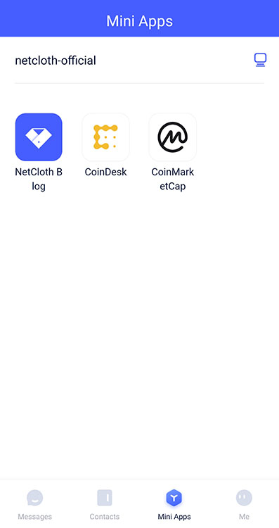

# How to configure and upload your own Mini APPs Portal
NetCloth APP (version 1.1.7 or later) has supported the display of distributed application platforms. Each starfish node can customize the Mini APPs Portal and configure its own Mini APPs.

## 1.Configure the front page of the Mini APPs Portal
The front-end display page of the Mini APPs Portal is composed of H5. [Click here](https://github.com/netcloth/Home-H5) to get the open source H5 display page and configuration method.

## 2. Blockchain operations
In the previous step, we configured the H5 display front end. Now we will publish its link to the NetCloth blockchain, so that users using the NetCloth APP can see your Mini APPs Portal.

Use IPAL claim, register as a starfish node, and send IPAL claim your service address.

### 2.1 Join the test network and synchronize blocks
You need to set up a blockchain node for the testnet, and then proceed to the next step after the blocks are synchronized. See [here](../get-started/how-to-join-testnet.md) for details.

If you have already set up a blockchain node, please skip this step.

### 2.2 Register a starfish node and send IPAL statement

Example (take the NetCloth Official node as an example)
```
nchcli ipal claim --from=$(nchcli keys show -a alice) --moniker=netcloth --website="www.netcloth.org" --endpoints="1|http://219.22.22.22,3|http://<Your Mini Apps Portal IP or domain>" --details="netcloth official server endpoint" --bond=100000000000000000pnch``

```
Among them, the endpointsis composed of an array, and the numeric part indicates the Service Type, and the domain name or IP followed by it is the address of the service. Among them, 1 represents the entrance address of the IM server of the starfish node, and 3 represents your H5 front-end address.

To learn more about IPAL, please click [here](./ipal.md).

To learn more about the types of IPAL Service Type, please click [here](./ipal-service-type.md).

After the IPAL declaration is successful, your starfish node is registered successfully. Now you just need to find your node in NetCloth's "Settings"-> "Client Service Settings"-> "Application Address"-> and choose your starfish node to connect. You can see your Mini APPs Portal on the NetCloth APP.


