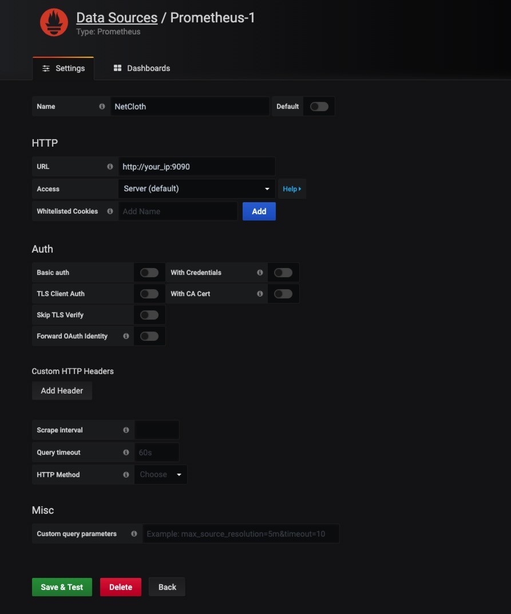
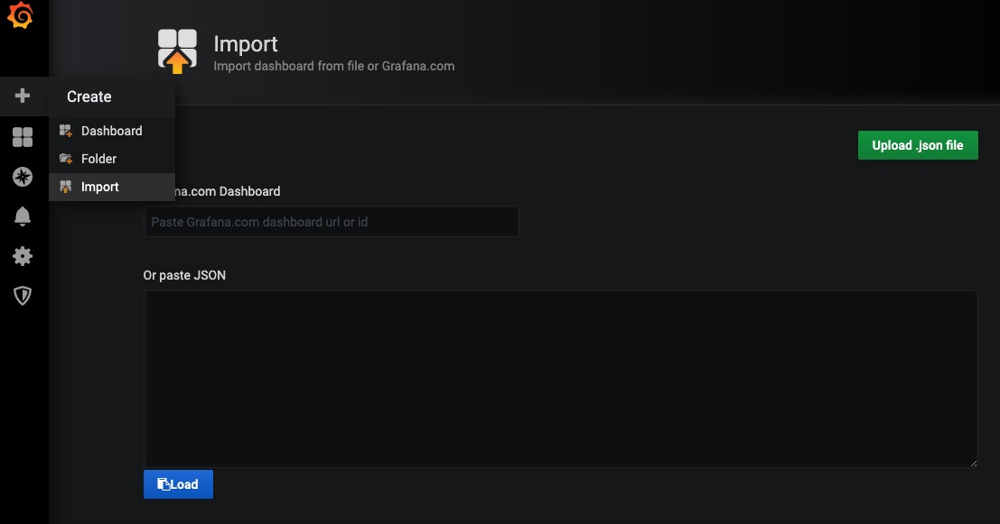

# 节点监控工具

本文介绍如何基于Prometheus + Grafana 开源工具，搭建NetCloth节点监控。

## 1. 开启 Prometheus metrics

修改```~/.nchd/config/config.toml```， 开启Prometheus metrics。

```properties
prometheus = true

prometheus_listen_addr = ":26660"
```

修改配置文件后，重启```nchd```即生效。 如何重启节点，点击[这里](../Q&A.md#如何重启节点程序)。

## 2. 安装 Prometheus 和 Grafana

* 安装Prometheus
  
```bash
sudo apt-get update
sudo apt-get install prometheus
```

* 安装Grafana
  
点击[这里](https://grafana.com/docs/grafana/latest/installation/debian/)，安装Grafana。或者执行如下命令：

```bash
sudo apt-get install -y apt-transport-https
sudo apt-get install -y software-properties-common wget
wget -q -O - https://packages.grafana.com/gpg.key | sudo apt-key add -

sudo add-apt-repository "deb https://packages.grafana.com/oss/deb stable main"

sudo apt-get update
sudo apt-get install grafana
```

## 3. 启动Prometheus 和 Grafana

* **修改Prometheus配置**
  
修改配置文件```/etc/prometheus/prometheus.yml```， 添加如下配置：
  
```properties
  - job_name: 'netcloth'
    static_configs:
    - targets: ['your_ip:26660']
      labels:
        instance: my_nch_node
```

其中 ```['your_ip:26660']``` 改为你的IP地址, ```my_nch_node```为自定义instance。

配置文件修改完成后,可通过[YAML Lint](http://www.yamllint.com/)验证配置文件内容。

* **启动Prometheus**

```bash
sudo prometheus --config.file=/etc/prometheus/prometheus.yml
```

* **启动Grafana**

```bash
sudo service grafana-server start
```

* 添加DataSource

访问```http://your_ip:3000/```打开, 默认的用户名和密码均为admin。

添加Data Source 如下图，点击```Save & Test``` 完成添加。



* 添加仪表盘

点击左上侧的"+"按键并选择"import“，打开import页面，将[此处](https://github.com/iavl/monitor/blob/master/nch_dashboard.json)的json文件粘贴到对话框，并点击"Load"，完成仪表盘添加。


